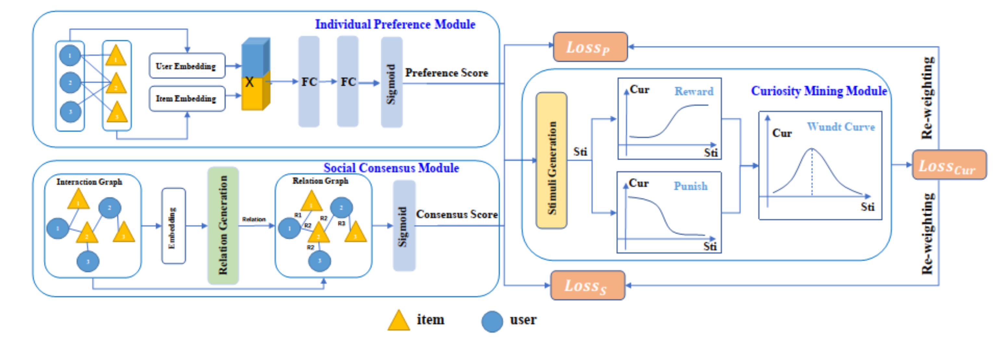

# P3C
This repository contains the code (Pytorch) of "P3C: A Curiosity-Driven Recommendation Method Based on Preference and Consensus", which is a project created to explore the combination of `Curiosity theory` and `Recommendation system`.

The command are listed in `run.sh`.
